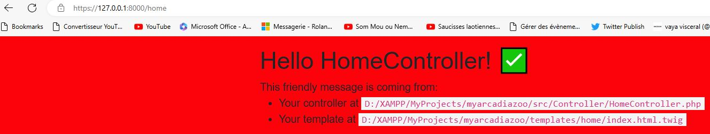
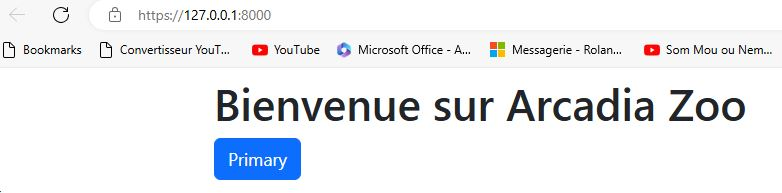
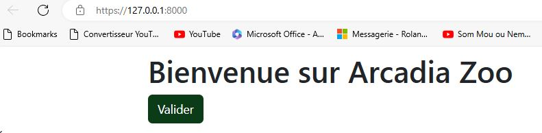

# Site Arcadia Zoo 

### Initialiser le projet Symfony7  
  


### Intégration de Bootstrap
Je reviens à la documentation de Bootstrap, on a plusieurs manières d'intégrer Bootstrap dans un projet, j'ai choisi la plus simple via CDN je copie la version en cache de CSS et coller dans fichier "base.html.twig" entre la balise ouvrante et fermante de "head".  

[Lien Bootstrap](https://getbootstrap.com/docs/5.3/getting-started/download/)
```twig
<head>
<!DOCTYPE html>
<html>

<link href="https://cdn.jsdelivr.net/npm/bootstrap@5.3.3/dist/css/bootstrap.min.css" rel="stylesheet" integrity="sha384-QWTKZyjpPEjISv5WaRU9OFeRpok6YctnYmDr5pNlyT2bRjXh0JMhjY6hW+ALEwIH" crossorigin="anonymous">  

</head>
```
Pour le JavaScript compilé et Popper de la même manière je copie les liens via un CDN et coller dans fichier "base.html.twig" avant la balise fermante de "body".  

```twig
<script src="https://cdn.jsdelivr.net/npm/@popperjs/core@2.11.8/dist/umd/popper.min.js" integrity="sha384-I7E8VVD/ismYTF4hNIPjVp/Zjvgyol6VFvRkX/vR+Vc4jQkC+hVqc2pM8ODewa9r" crossorigin="anonymous"></script>
<script src="https://cdn.jsdelivr.net/npm/bootstrap@5.3.3/dist/js/bootstrap.min.js" integrity="sha384-0pUGZvbkm6XF6gxjEnlmuGrJXVbNuzT9qBBavbLwCsOGabYfZo0T0to5eqruptLy" crossorigin="anonymous"></script>
</body>
```
Pour tester j'actualise la page et la police change, le CSS de Bootstrap a bien fonctionné.

### Installation de sass pour Symfony (bundle)

Cette fois-ci avec la documentation de Symfony, avant de le faire j'ai installé extension "Live Sass Compiler" pour générer le fichier scss sur mon Visual Studio Code, une fois installé j'ai un bouton "Watch Sass" sur la barre de status en bas de l'éditeur, je dois cliquer sur ce bouton quand je veux compiler mes fichiers scss.

[Lien Symfony](https://symfony.com/bundles/SassBundle/current/index.html)

Installation de bundle :  
Je lance la commande de l'installation.

```php
composer require symfonycasts/sass-bundle
```
Une fois l'installation est terminéé, j'ajoute un fichier "app.scss" dans le répertoire "assets/styles/app.scss" et aussi le style de base dans ce dernier.  

```scss
/* assets/styles/app.scss */

$red: #fc030b;

body {
  background: $red;
}
```
Ensuite, je pointe mes styles dans mon modèle "templates/base.html.twig" dans le block stysheets.  

```twig
{# templates/base.html.twig #}


    <link rel="stylesheet" href="{{ asset('styles/app.scss') }}">

```
Je clique sur le bouton "Watch Sass" le fichier "app.scss" est généré en app.css   

Fichier app.css.
```scss
/* assets/styles/app.scss */
body {
  background: #fc030b;
}/*# sourceMappingURL=app.css.map */
```
Et j'actualise la page pour tester.  



Le bundle sass pour Symfony fonctionne bien, il est temps pour moi de modifier les couleurs de Bootstrap, j'ai défini les quatre couleurs que je voulais utiliser pour mon application dans Charte Graphique sur Figma.  

[Lien Figma](https://www.figma.com/design/u9WRTomub3dcGjSojmiRNO/Arcadia-Zoo?node-id=18-4&t=KbvoCMtqwAFVXDS7-0)  

Je vais maintenant modifier les couleurs de Bootstrap "primary, secondary, dark et blue" dans mon fichier "app.scss".  

```scss
/* Inclure ici tous les remplacements de variables par défaut */

$primary: #088A29;
$secondary: #0B6121;
$dark: #0B3B17;
$blue: #08088A;

body {
    background: $red;
}
```  

Pour tester je vais créer un bouton sur ma page d'accueil et de le mettre la couleur "$dark".  

Je commence par modifier le code de ma page d'accueil et mettre un bouton avec la couleur par défaut de Bootstrap.  

```twig
{# templates/home/index.html.twig #}



Arcadia Zoo



	<div class="container mt-2">
		<h1>Bienvenue sur Arcadia Zoo</h1>
		<button type="button" class="btn">Valider</button>
	</div>


```  
J'actualise la page j'ai aperçu que le Framework Bootstrap fonctionne bien.

  

Je vais maintenant changer la couleur de bouton qui est la couleur par défaut de Bootstrap par la couleur $dark.  
```scss
/* assets/styles/app.scss */

body {
    background: $white;
}

.btn {
    background-color: $dark;
    color: $white;
}
```
J'actualise la page pour tester, tout fonctionne comme je voulais.

  


